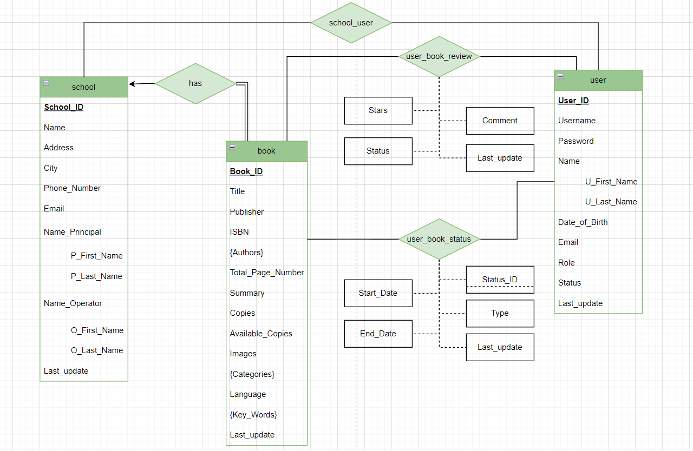

## This project is part of our Semester Project for the class "Databases" in the 6th semester of the School of Electrical and Computer Engineering of the National Technical University of Athens

## Installation Guide

Before we begin make sure you have installed the latest version of Python
and you have a program like [XAMPP](https://www.apachefriends.org/download.html) installed to test the code in a local server.

### Step-by-Step instructions

1. Open the terminal and go to the directory you would like to store the app files.
2. Make sure you are running the local host server.
3. In the terminal clone the GitHub repository with this command: 
	git clone https://github.com/StavrosXr/Database-Library
4. In the terminal do this command to change the directory to the one we just made:
	"cd Database-Library"
5. In the terminal run the following script to download all required libraries:
	"pip install -r requirements.txt"
6. To download the database, we first need to go to the directory that you have the bin of the installed XAMPP (for example: C:\xampp\mysql\bin)
7. Execute this command to make the library:
	"mysql -u root -p -e "CREATE DATABASE library;"
	When prompted to enter a password, hit ENTER.
8. Then in the terminal, execute this command to load the database:
	mysql -u root -p -h localhost library < {backup_file_path}
	where {backup_file_path} is the path to the library.sql file. 
	for example "..\Database-Library\library.sql
9. Type "exit" to exit MariaDB. Go back to the directory of the project ( "..\Database-Library\ ) 
10. Depending on your python version use the command python3 app.py or python app.py or py app.py and visit http://localhost:5000/ from a browser to run the web app.
	

